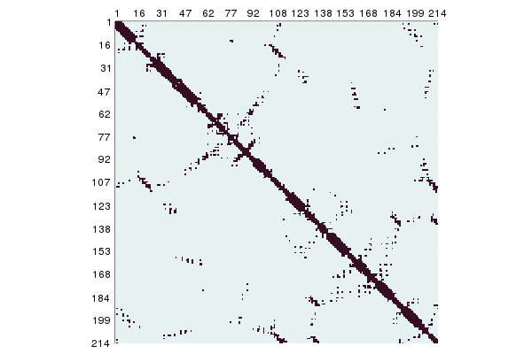
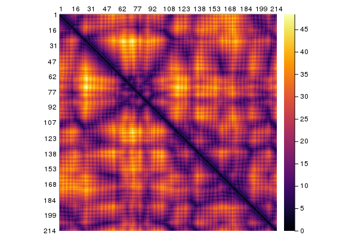
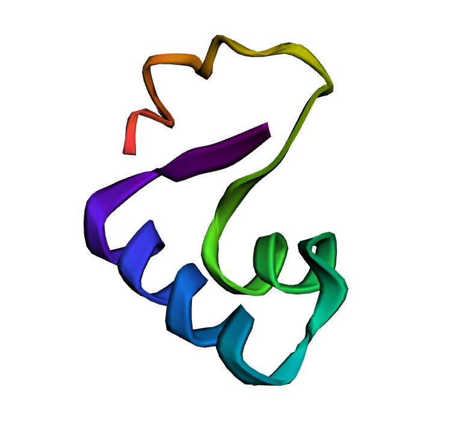
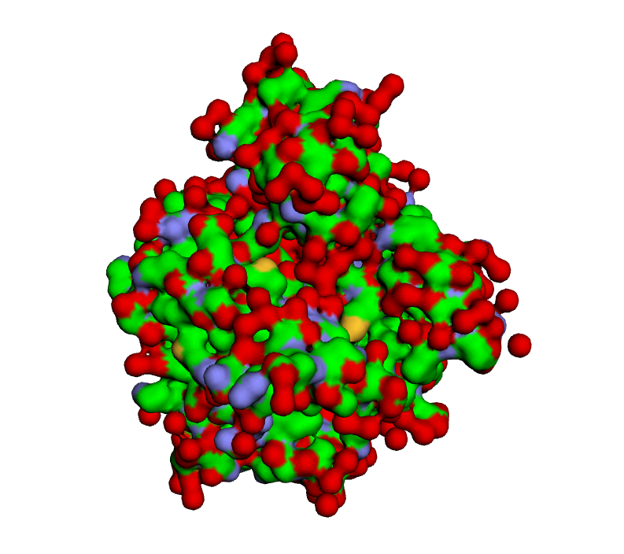

# BioStructures documentation

The BioStructures.jl package provides functionality to manipulate macromolecular structures, and in particular to read and write [Protein Data Bank](http://www.rcsb.org/pdb/home/home.do) (PDB) and mmCIF files.
It is designed to be used for standard structural analysis tasks, as well as acting as a platform on which others can build to create more specific tools.

It compares favourably in terms of performance to other PDB parsers - see some [benchmarks](https://github.com/jgreener64/pdb-benchmarks).
The PDB and mmCIF parsers currently read in the whole PDB without explicit errors (with one exception).
Help can be found on individual functions using `?function_name`.


## Basics

To download a PDB file:

```julia
using BioStructures

# Stored in the current working directory by default
downloadpdb("1EN2")
```

To parse a PDB file into a Structure-Model-Chain-Residue-Atom framework:

```julia
julia> struc = read("/path/to/pdb/file.pdb", PDB)
ProteinStructure 1EN2.pdb with 1 models, 1 chains (A), 85 residues, 754 atoms
```

mmCIF files can be read into the same data structure with `read("/path/to/cif/file.cif", MMCIF)`.
If you want to read an mmCIF file into a dictionary to query yourself (e.g. to access metadata fields), use `MMCIFDict`:

```julia
julia> mmcif_dict = MMCIFDict("/path/to/cif/file.cif")
mmCIF dictionary with 716 fields

julia> mmcif_dict["_entity_src_nat.common_name"]
1-element Array{String,1}:
 "great nettle"
```

A `MMCIFDict` can be accessed in similar ways to a standard dictionary, and if necessary the underlying dictionary of `MMCIFDict` `d` can be accessed with `d.dict`.
Note that the elements of the dictionary are always an `Array{String,1}`, even if only one value was read in or the data is numerical.

Refer to [Downloading PDB files](#Downloading-PDB-files-1) and [Reading PDB files](#Reading-PDB-files-1) sections for more options.

The elements of `struc` can be accessed as follows:

| Command                     | Returns                                                                         | Return type       |
| :-------------------------- | :------------------------------------------------------------------------------ | :---------------- |
| `struc[1]`                  | Model 1                                                                         | `Model`           |
| `struc[1]["A"]`             | Model 1, chain A                                                                | `Chain`           |
| `struc[1]['A']`             | Shortcut to above if the chain ID is a single character                         | `Chain`           |
| `struc["A"]`                | The lowest model (model 1), chain A                                             | `Chain`           |
| `struc["A"]["50"]`          | Model 1, chain A, residue 50                                                    | `AbstractResidue` |
| `struc["A"][50]`            | Shortcut to above if it is not a hetero residue and the insertion code is blank | `AbstractResidue` |
| `struc["A"]["H_90"]`        | Model 1, chain A, hetero residue 90                                             | `AbstractResidue` |
| `struc["A"][50]["CA"]`      | Model 1, chain A, residue 50, atom name CA                                      | `AbstractAtom`    |
| `struc["A"][15]["CG"]['A']` | For disordered atoms, access a specific location                                | `Atom`            |

Disordered atoms are stored in a `DisorderedAtom` container but calls fall back to the default atom, so disorder can be ignored if you are not interested in it.
Disordered residues (i.e. point mutations with different residue names) are stored in a `DisorderedResidue` container.

The idea is that disorder will only bother you if you want it to.
See the [Biopython discussion](http://biopython.org/wiki/The_Biopython_Structural_Bioinformatics_FAQ#How_is_disorder_handled.3F) for more.

Properties can be retrieved as follows:

| Function             | Returns                                                       | Return type                     |
| :------------------- | :------------------------------------------------------------ | :------------------------------ |
| `serial`             | Serial number of an atom                                      | `Int`                           |
| `atomname`           | Name of an atom                                               | `String`                        |
| `altlocid`           | Alternative location ID of an atom                            | `Char`                          |
| `altlocids`          | All alternative location IDs in a `DisorderedAtom`            | `Array{Char,1}`                 |
| `x`                  | x coordinate of an atom                                       | `Float64`                       |
| `y`                  | y coordinate of an atom                                       | `Float64`                       |
| `z`                  | z coordinate of an atom                                       | `Float64`                       |
| `coords`             | coordinates of an atom                                        | `Array{Float64,1}`              |
| `occupancy`          | Occupancy of an atom (default is `1.0`)                       | `Float64`                       |
| `tempfactor`         | Temperature factor of an atom (default is `0.0`)              | `Float64`                       |
| `element`            | Element of an atom (default is `"  "`)                        | `String`                        |
| `charge`             | Charge of an atom (default is `"  "`)                         | `String`                        |
| `residue`            | Residue an atom belongs to                                    | `Residue`                       |
| `ishetero`           | `true` if the residue or atom is a hetero residue/atom        | `Bool`                          |
| `isdisorderedatom`   | `true` if the atom is disordered                              | `Bool`                          |
| `pdbline`            | PDB ATOM/HETATM record for an atom                            | `String`                        |
| `resname`            | Residue name of a residue or atom                             | `String`                        |
| `resnames`           | All residue names in a `DisorderedResidue`                    | `Array{String,1}`               |
| `resnumber`          | Residue number of a residue or atom                           | `Int`                           |
| `sequentialresidues` | Determine if the second residue follows the first in sequence | `Bool`                          |
| `inscode`            | Insertion code of a residue or atom                           | `Char`                          |
| `resid`              | Residue ID of an atom or residue (`full=true` includes chain) | `String`                        |
| `atomnames`          | Atom names of the atoms in a residue, sorted by serial        | `Array{String,1}`               |
| `atoms`              | Dictionary of atoms in a residue                              | `Dict{String, AbstractAtom}`    |
| `isdisorderedres`    | `true` if the residue has multiple residue names              | `Bool`                          |
| `disorderedres`      | Access a particular residue name in a `DisorderedResidue`     | `Residue`                       |
| `chain`              | Chain a residue or atom belongs to                            | `Chain`                         |
| `chainid`            | Chain ID of a chain, residue or atom                          | `String`                        |
| `resids`             | Sorted residue IDs in a chain                                 | `Array{String,1}`               |
| `residues`           | Dictionary of residues in a chain                             | `Dict{String, AbstractResidue}` |
| `model`              | Model a chain, residue or atom belongs to                     | `Model`                         |
| `modelnumber`        | Model number of a model, chain, residue or atom               | `Int`                           |
| `chainids`           | Sorted chain IDs in a model or structure                      | `Array{String,1}`               |
| `chains`             | Dictionary of chains in a model or structure                  | `Dict{String, Chain}`           |
| `structure`          | Structure a model, chain, residue or atom belongs to          | `ProteinStructure`              |
| `structurename`      | Name of the structure an element belongs to                   | `String`                        |
| `modelnumbers`       | Sorted model numbers in a structure                           | `Array{Int,1}`                  |
| `models`             | Dictionary of models in a structure                           | `Dict{Int, Model}`              |

The `strip` keyword argument determines whether surrounding whitespace is stripped for `atomname`, `element`, `charge`, `resname` and `atomnames` (default `true`).

The coordinates of an atom can be set using `x!`, `y!`, `z!` and `coords!`.


## Manipulating structures

Elements can be looped over to reveal the sub-elements in the correct order:

```julia
for mod in struc
    for ch in mod
        for res in ch
            for at in res
                # Do something
            end
        end
    end
end
```

Models are ordered numerically; chains are ordered by chain ID character ordering, except the empty chain is last; residues are ordered by residue number and insertion code with hetero residues after standard residues; atoms are ordered by atom serial.
If you want the first sub-element you can use `first`.
For example `first(struc[1])` gets the first chain in model 1.
Since the ordering of elements is defined you can use the `sort` function.
For example `sort(res)` sorts a list of residues as described above, or `sort(res, by=resname)` will sort them alphabetically by residue name.

`collect` can be used to get arrays of sub-elements.
`collectatoms`, `collectresidues`, `collectchains` and `collectmodels` return arrays of a particular type from a structural element or element array.

Selectors are functions passed as additional arguments to these functions.
Only elements that return `true` when passed to all the selector are retained.
For example:

| Command                                                 | Action                                                            | Return type                |
| :------------------------------------------------------ | :---------------------------------------------------------------- | :------------------------- |
| `collect(struc['A'][50])`                               | Collect the sub-elements of an element, e.g. atoms from a residue | `Array{AbstractAtom,1}`    |
| `collectresidues(struc)`                                | Collect the residues of an element                                | `Array{AbstractResidue,1}` |
| `collectatoms(struc) `                                  | Collect the atoms of an element                                   | `Array{AbstractAtom,1}`    |
| `collectatoms(struc, calphaselector)`                   | Collect the C-alpha atoms of an element                           | `Array{AbstractAtom,1}`    |
| `collectatoms(struc, calphaselector, disorderselector)` | Collect the disordered C-alpha atoms of an element                | `Array{AbstractAtom,1}`    |

The selectors available are:

| Function          | Acts on                             | Selects for                                         |
| :---------------- | :---------------------------------- | :-------------------------------------------------- |
| standardselector  | `AbstractAtom` or `AbstractResidue` | Atoms/residues arising from standard (ATOM) records |
| heteroselector    | `AbstractAtom` or `AbstractResidue` | Atoms/residues arising from hetero (HETATM) records |
| atomnameselector  | `AbstractAtom`                      | Atoms with atom name in a given list                |
| calphaselector    | `AbstractAtom`                      | C-alpha atoms                                       |
| cbetaselector     | `AbstractAtom`                      | C-beta atoms, or C-alpha atoms for glycine residues |
| backboneselector  | `AbstractAtom`                      | Atoms in the protein backbone (CA, N and C)         |
| heavyatomselector | `AbstractAtom`                      | Non-hydrogen atoms                                  |
| hydrogenselector  | `AbstractAtom`                      | Hydrogen atoms                                      |
| resnameselector   | `AbstractAtom` or `AbstractResidue` | Atoms/residues with residue name in a given list    |
| waterselector     | `AbstractAtom` or `AbstractResidue` | Atoms/residues with residue name HOH                |
| notwaterselector  | `AbstractAtom` or `AbstractResidue` | Atoms/residues with residue name not HOH            |
| disorderselector  | `AbstractAtom` or `AbstractResidue` | Atoms/residues with alternative locations           |

To create a new `atomnameselector` or `resnameselector`:
```julia
cdeltaselector(at::AbstractAtom) = atomnameselector(at, ["CD"])
```

It is easy to define your own atom, residue, chain or model selectors.
The below will collect all atoms with x coordinate less than 0:

```julia
xselector(at) = x(at) < 0
collectatoms(struc, xselector)
```

Alternatively, you can use an anonymous function:

```julia
collectatoms(struc, at -> x(at) < 0)
```

`countatoms`, `countresidues`, `countchains` and `countmodels` can be used to count elements with the same selector API.
For example:

```julia
julia> countatoms(struc)
754

julia> countatoms(struc, calphaselector)
85

julia> countresidues(struc, standardselector)
85
```

The amino acid sequence of a protein can be retrieved by passing an element to `AminoAcidSequence` with optional residue selectors:

```julia
julia> AminoAcidSequence(struc['A'], standardselector)
85aa Amino Acid Sequence:
RCGSQGGGSTCPGLRCCSIWGWCGDSEPYCGRTCENKCWSGERSDHRCGAAVGNPPCGQDRCCSVHGWCGGGNDYCSGGNCQYRC
```

The `gaps` keyword argument determines whether to add gaps to the sequence based on missing residue numbers (default `true`).
See [BioSequences.jl](https://github.com/BioJulia/BioSequences.jl) and [BioAlignments.jl](https://github.com/BioJulia/BioAlignments.jl) for more on how to deal with sequences.
For example, to see the alignment of CDK1 and CDK2 (this example also makes use of Julia's [broadcasting](https://docs.julialang.org/en/v1/manual/arrays/#Broadcasting-1)):

```julia
julia> struc1, struc2 = retrievepdb.(["4YC6", "1HCL"])
2-element Array{ProteinStructure,1}:
 ProteinStructure 4YC6.pdb with 1 models, 8 chains (A,B,C,D,E,F,G,H), 1420 residues, 12271 atoms
 ProteinStructure 1HCL.pdb with 1 models, 1 chains (A), 294 residues, 2546 atoms

julia> seq1, seq2 = AminoAcidSequence.([struc1["A"], struc2["A"]], standardselector, gaps=false)
2-element Array{BioSequences.BioSequence{BioSequences.AminoAcidAlphabet},1}:
 MEDYTKIEKIGEGTYGVVYKGRHKTTGQVVAMKKIRLES…SHVKNLDENGLDLLSKMLIYDPAKRISGKMALNHPYFND
 MENFQKVEKIGEGTYGVVYKARNKLTGEVVALKKIRTEG…RSLLSQMLHYDPNKRISAKAALAHPFFQDVTKPVPHLRL

julia> using BioAlignments

julia> scoremodel = AffineGapScoreModel(BLOSUM62, gap_open=-10, gap_extend=-1);

julia> alres = pairalign(GlobalAlignment(), seq1, seq2, scoremodel)
PairwiseAlignmentResult{Int64,BioSequences.BioSequence{BioSequences.AminoAcidAlphabet},BioSequences.BioSequence{BioSequences.AminoAcidAlphabet}}:
  score: 945
  seq:   1 MEDYTKIEKIGEGTYGVVYKGRHKTTGQVVAMKKIRLESEEEGVPSTAIREISLLKELRH  60
           ||   | ||||||||||||| | | || ||| |||| |    |||||||||||||||| |
  ref:   1 MENFQKVEKIGEGTYGVVYKARNKLTGEVVALKKIRTE----GVPSTAIREISLLKELNH  56

  seq:  61 PNIVSLQDVLMQDSRLYLIFEFLSMDLKKYLD-SIPPGQYMDSSLVKSYLYQILQGIVFC 119
           |||| | ||      ||| ||||  ||||  | |   |      | |||| | |||  ||
  ref:  57 PNIVKLLDVIHTENKLYLVFEFLHQDLKKFMDASALTG--IPLPLIKSYLFQLLQGLAFC 114

  seq: 120 HSRRVLHRDLKPQNLLIDDKGTIKLADFGLARAFGV----YTHEVVTLWYRSPEVLLGSA 175
           || ||||||||||||||   | ||||||||||||||    ||||||||||| || |||
  ref: 115 HSHRVLHRDLKPQNLLINTEGAIKLADFGLARAFGVPVRTYTHEVVTLWYRAPEILLGCK 174

  seq: 176 RYSTPVDIWSIGTIFAELATKKPLFHGDSEIDQLFRIFRALGTPNNEVWPEVESLQDYKN 235
            ||| ||||| | ||||  |   || ||||||||||||| ||||   ||| | |  |||
  ref: 175 YYSTAVDIWSLGCIFAEMVTRRALFPGDSEIDQLFRIFRTLGTPDEVVWPGVTSMPDYKP 234

  seq: 236 TFPKWKPGSLASHVKNLDENGLDLLSKMLIYDPAKRISGKMALNHPYFND---------- 285
            ||||        |  ||| |  ||| || ||| |||| | || || | |
  ref: 235 SFPKWARQDFSKVVPPLDEDGRSLLSQMLHYDPNKRISAKAALAHPFFQDVTKPVPHLRL 294

```

In fact, `pairalign` is extended to carry out the above steps and return the alignment by calling `pairalign(struc1["A"], struc2["A"], standardselector)` in this case.
`scoremodel` and `aligntype` are keyword arguments with the defaults shown above.


## Spatial calculations

Various functions are provided to calculate spatial quantities for proteins:

| Command              | Returns                                                                                          |
| :------------------- | :----------------------------------------------------------------------------------------------- |
| `distance`           | Minimum distance between two elements                                                            |
| `sqdistance`         | Minimum square distance between two elements                                                     |
| `coordarray`         | Atomic coordinates in Å of an element as a 2D `Array` with each column corresponding to one atom |
| `bondangle`          | Angle between three atoms                                                                        |
| `dihedralangle`      | Dihedral angle defined by four atoms                                                             |
| `omegaangle`         | Omega dihedral angle between a residue and the previous residue                                  |
| `phiangle`           | Phi dihedral angle between a residue and the previous residue                                    |
| `psiangle`           | Psi dihedral angle between a residue and the next residue                                        |
| `omegaangles`        | `Vector` of omega dihedral angles of an element                                                  |
| `phiangles`          | `Vector` of phi dihedral angles of an element                                                    |
| `psiangles`          | `Vector` of psi dihedral angles of an element                                                    |
| `ramachandranangles` | `Vector`s of phi and psi angles of an element                                                    |
| `ContactMap`         | `ContactMap` of two elements, or one element with itself                                         |
| `DistanceMap`        | `DistanceMap` of two elements, or one element with itself                                        |
| `showcontactmap`     | Print a representation of a `ContactMap` to `stdout` or a specified `IO` instance                |
| `rmsd`               | RMSD between two elements of the same size - assumes they are superimposed                       |
| `displacements`      | `Vector` of displacements between two elements of the same size - assumes they are superimposed  |
| `MetaGraph`          | Construct a `MetaGraph` of contacting elements                                                   |

The `omegaangle`, `phiangle` and `psiangle` functions can take either a pair of residues or a chain and a position.
The `omegaangle` and `phiangle` functions measure the angle between the residue at the given index and the one before.
The `psiangle` function measures between the given index and the one after.
For example:

```julia
julia> distance(struc['A'][10], struc['A'][20])
10.782158874733762

julia> rad2deg(bondangle(struc['A'][50]["N"], struc['A'][50]["CA"], struc['A'][50]["C"]))
110.77765846083398

julia> rad2deg(dihedralangle(struc['A'][50]["N"], struc['A'][50]["CA"], struc['A'][50]["C"], struc['A'][51]["N"]))
-177.38288114072924

julia> rad2deg(psiangle(struc['A'][50], struc['A'][51]))
-177.38288114072924

julia> rad2deg(psiangle(struc['A'], 50))
-177.38288114072924
```

`ContactMap` takes in a structural element or a list, such as a `Chain` or `Vector{Atom}`, and returns a `ContactMap` object showing the contacts between the elements for a specified distance.
`ContactMap` can also be given two structural elements as arguments, in which case a non-symmetrical 2D array is returned showing contacts between the elements.
The underlying `BitArray{2}` for `ContactMap` `contacts` can be accessed with `contacts.data` if required.

```julia
julia> contacts = ContactMap(collectatoms(struc['A'], cbetaselector), 8.0)
Contact map of size (85, 85)
```

A [plot recipe](http://docs.juliaplots.org/latest/recipes) is defined for this so it can shown with [Plots.jl](http://docs.juliaplots.org/latest):

```julia
using Plots
plot(contacts)
```



For a quick, text-based representation of a `ContactMap` use `showcontactmap`.

`DistanceMap` works in an analogous way to `ContactMap` and gives a map of the distances. It can also be plotted:

```julia
dists = DistanceMap(collectatoms(struc['A'], cbetaselector))
using Plots
plot(dists)
```



The contacting elements in a molecular structure form a graph, and this can be retrieved using `MetaGraph`.
This extends `MetaGraph` from [MetaGraphs.jl](https://github.com/JuliaGraphs/MetaGraphs.jl), allowing you to use all the graph analysis tools in [LightGraphs.jl](https://github.com/JuliaGraphs/LightGraphs.jl).
For example:

```julia
julia> mg = MetaGraph(collectatoms(struc["A"], cbetaselector), 8.0)
{85, 423} undirected Int64 metagraph with Float64 weights defined by :weight (default weight 1.0)

julia> using LightGraphs, MetaGraphs

julia> nv(mg)
85

julia> ne(mg)
423

julia> get_prop(mg, :contactdist)
8.0

julia> mg[10, :element]
Atom CB with serial 71, coordinates [-3.766, 4.031, 23.526]
```

See the [LightGraphs docs](https://juliagraphs.github.io/LightGraphs.jl/latest) for details on how to calculate properties such as shortest paths, centrality measures, community detection and more.
Similar to `ContactMap`, contacts are found between any element type passed in.
So if you wanted the graph of chain contacts in a protein complex you could give a `Model` as the first argument.


## Downloading PDB files

To download a PDB file to a specified directory:

```julia
downloadpdb("1EN2", pdb_dir="path/to/pdb/directory")
```

To download multiple PDB files to a specified directory:

```julia
downloadpdb(["1EN2", "1ALW", "1AKE"], pdb_dir="path/to/pdb/directory")
```

To download a PDB file in PDB, XML, MMCIF or MMTF format use the `file_format` argument:

```julia
downloadpdb("1ALW", pdb_dir="path/to/pdb/directory", file_format=MMTF)

# To get XML
downloadpdb("1ALW", pdb_dir="path/to/pdb/directory", file_format=PDBXML)
```

To apply a function to a downloaded file and delete the file afterwards:

```julia
downloadpdb(f, "1ALW")
```

Or, using Julia's `do` syntax:

```julia
downloadpdb("1ALW") do fp
    s = read(fp, PDB)
    # Do something
end
```


## Reading PDB files

To parse an existing PDB file into a Structure-Model-Chain-Residue-Atom framework:

```julia
julia> struc = read("/path/to/pdb/file.pdb", PDB)
ProteinStructure 1EN2.pdb with 1 models, 1 chains (A), 85 residues, 754 atoms
```

Read a mmCIF file instead by replacing `PDB` with `MMCIF`.
Various options can be set through optional keyword arguments when parsing PDB/mmCIF files:

| Keyword Argument                 | Description                                                                        |
| :------------------------------- | :--------------------------------------------------------------------------------- |
| `structure_name::AbstractString` | The name given to the returned `ProteinStructure`; defaults to the file name       |
| `remove_disorder::Bool=false`    | Whether to remove atoms with alt loc ID not ' ' or 'A'.                            |
| `read_std_atoms::Bool=true`      | Whether to read standard ATOM records.                                             |
| `read_het_atoms::Bool=true`      | Whether to read HETATOM records.                                                   |

The function `readpdb` provides an alternative way to read PDB files with a similar interface to `downloadpdb`.
To parse a PDB file by specifying the PDB ID and PDB directory:

```julia
struc = readpdb("1EN2", pdb_dir="/path/to/pdb/directory")
```

The same keyword arguments are taken as `read` above, plus `pdb_dir` and `ba_number`.

Use `retrievepdb` to download and parse a PDB file into a Structure-Model-Chain-Residue-Atom framework in a single line:

```julia
julia> struc = retrievepdb("1ALW", pdb_dir="path/to/pdb/directory")
INFO: Downloading PDB: 1ALW
ProteinStructure 1ALW.pdb with 1 models, 2 chains (A,B), 346 residues, 2928 atoms
```

If you prefer to work with data frames rather than the data structures in BioStructures, the `DataFrame` constructor from [DataFrames.jl](https://github.com/JuliaData/DataFrames.jl) has been extended to construct relevant data frames from lists of atoms or residues:

```julia
julia> df = DataFrame(collectatoms(struc));

julia> first(df, 3)
3×17 DataFrame. Omitted printing of 5 columns
│ Row │ ishetero │ serial │ atomname │ altlocid │ resname │ chainid │ resnumber │ inscode │ x       │ y       │ z       │ occupancy │
│     │ Bool     │ Int64  │ String   │ Char     │ String  │ String  │ Int64     │ Char    │ Float64 │ Float64 │ Float64 │ Float64   │
├─────┼──────────┼────────┼──────────┼──────────┼─────────┼─────────┼───────────┼─────────┼─────────┼─────────┼─────────┼───────────┤
│ 1   │ false    │ 1      │ N        │ ' '      │ GLU     │ A       │ 94        │ ' '     │ 15.637  │ -47.066 │ 18.179  │ 1.0       │
│ 2   │ false    │ 2      │ CA       │ ' '      │ GLU     │ A       │ 94        │ ' '     │ 14.439  │ -47.978 │ 18.304  │ 1.0       │
│ 3   │ false    │ 3      │ C        │ ' '      │ GLU     │ A       │ 94        │ ' '     │ 14.141  │ -48.183 │ 19.736  │ 1.0       │

julia> df = DataFrame(collectresidues(struc));

julia> first(df, 3)
3×8 DataFrame
│ Row │ ishetero │ resname │ chainid │ resnumber │ inscode │ countatoms │ modelnumber │ isdisorderedres │
│     │ Bool     │ String  │ String  │ Int64     │ Char    │ Int64      │ Int64       │ Bool            │
├─────┼──────────┼─────────┼─────────┼───────────┼─────────┼────────────┼─────────────┼─────────────────┤
│ 1   │ false    │ GLU     │ A       │ 94        │ ' '     │ 9          │ 1           │ false           │
│ 2   │ false    │ GLU     │ A       │ 95        │ ' '     │ 9          │ 1           │ false           │
│ 3   │ false    │ VAL     │ A       │ 96        │ ' '     │ 7          │ 1           │ false           │
```


## Writing PDB files

PDB format files can be written:

```julia
writepdb("1EN2_out.pdb", struc)
```

Any element type can be given as input to `writepdb`.
Atom selectors can also be given as additional arguments:

```julia
# Only backbone atoms are written out
writepdb("1EN2_out.pdb", struc, backboneselector)
```

The first argument can also be a stream.
To write mmCIF format files, use the `writemmcif` function with similar arguments.
A `MMCIFDict` can also be written using `writemmcif`:

```julia
writemmcif("1EN2_out.dic", mmcif_dict)
```

Multi-character chain IDs can be written to mmCIF files but will throw an error when written to a PDB file as the PDB file format only has one character allocated to the chain ID.

If you want the PDB record line for an `Atom`, use `pdbline`.
For example:

```julia
julia> pdbline(at)
"HETATM  101  C  A  X B  20      10.500  20.123  -5.123  0.50 50.13           C1+"
```

If you want to generate a PDB record line from values directly, do so using an `AtomRecord`:

```julia
julia> pdbline(AtomRecord(false, 669, "CA", ' ', "ILE", "A", 90, ' ', [31.743, 33.11, 31.221], 1.00, 25.76, "C", ""))
"ATOM    669  CA  ILE A  90      31.743  33.110  31.221  1.00 25.76           C  "
```

This can be useful when writing PDB files from your own data structures.


## RCSB PDB utility functions

To get the list of all PDB entries:

```julia
l = pdbentrylist()
```

To download the entire RCSB PDB database in your preferred file format:

```julia
downloadentirepdb(pdb_dir="path/to/pdb/directory", file_format=MMTF)
```

This operation takes a lot of disk space and time to complete (depending on internet connection).

To update your local PDB directory based on the weekly status list of new, modified and obsolete PDB files from the RCSB server:

```julia
updatelocalpdb(pdb_dir="path/to/pdb/directory", file_format=MMTF)
```

Obsolete PDB files are stored in the auto-generated `obsolete` directory inside the specified local PDB directory.

To maintain a local copy of the entire RCSB PDB database, run the `downloadentirepdb` function once to download all PDB files and set up a CRON job or similar to run `updatelocalpdb` function once a week to keep the local PDB directory up to date with the RCSB server.

There are a few more functions that may be useful:

| Function                 | Returns                                                                         | Return type                                                 |
| :----------------------- | :------------------------------------------------------------------------------ | :---------------------------------------------------------- |
| `pdbstatuslist`          | List of PDB entries from a specified RCSB weekly status list URL                | `Array{String,1}`                                           |
| `pdbrecentchanges`       | Added, modified and obsolete PDB lists from the recent RCSB weekly status files | `Tuple{Array{String,1},Array{String,1},` `Array{String,1}}` |
| `pdbobsoletelist`        | List of all obsolete PDB entries                                                | `Array{String,1}`                                           |
| `downloadallobsoletepdb` | Downloads all obsolete PDB files from the RCSB PDB server                       | `Array{String,1}`                                           |


## Visualising structures

The [Bio3DView.jl](https://github.com/jgreener64/Bio3DView.jl) package can be used to visualise molecular structures.
For example:

```julia
using Bio3DView
using Blink
viewpdb("1CRN")
```



```julia
struc = retrievepdb("1AKE")
viewstruc(struc['A'], surface=Surface(Dict("colorscheme"=> "greenCarbon")))
```



Here they are shown as static images but they are interactive when using Bio3DView.jl.
See the [Bio3DView.jl tutorial](http://nbviewer.jupyter.org/github/jgreener64/Bio3DView.jl/blob/master/examples/tutorial.ipynb) for more information.


## Examples

A few further examples of BioStructures usage are given below.

**A)** Plot the temperature factors of a protein:

```julia
using Plots
calphas = collectatoms(struc, calphaselector)
plot(resnumber.(calphas),
     tempfactor.(calphas),
     xlabel="Residue number",
     ylabel="Temperature factor",
     label="")
```

**B)** Print the PDB records for all C-alpha atoms within 5 Angstrom of residue 38:

```julia
for at in calphas
    if distance(struc['A'][38], at) < 5.0 && resnumber(at) != 38
        println(pdbline(at))
    end
end
```

**C)** Find the residues at the interface of a protein-protein interaction:

```julia
for res_a in collectresidues(struc["A"], standardselector)
    for res_b in collectresidues(struc["B"], standardselector)
        if distance(res_a, res_b) < 5.0
            println(resnumber(res_a), "A ", resnumber(res_b), "B")
        end
    end
end
```

**D)** Show the Ramachandran phi/psi angle plot of a structure:

```julia
using Plots
phi_angles, psi_angles = ramachandranangles(struc, standardselector)
scatter(rad2deg.(phi_angles),
     rad2deg.(psi_angles),
     title="Ramachandran plot",
     xlabel="Phi / degrees",
     ylabel="Psi / degrees",
     label="",
     xticks=[-180, -90, 0, 90, 180],
     yticks=[-180, -90, 0, 90, 180],
     xlims=(-180, 180),
     ylims=(-180, 180))
```

**E)** Calculate the RMSD and displacements between the heavy (non-hydrogen) atoms of two models in an NMR structure:

```julia
downloadpdb("1SSU")
struc_nmr = read("1SSU.pdb", PDB)
rmsd(struc_nmr[5], struc_nmr[10], heavyatomselector)
displacements(struc_nmr[5], struc_nmr[10], heavyatomselector)
```

**F)** Calculate the cysteine fraction of every structure in the PDB:

```julia
l = pdbentrylist()
for p in l
    downloadpdb(p, file_format=MMCIF) do fp
        s = read(fp, MMCIF)
        nres = countresidues(s, standardselector)
        if nres > 0
            frac = countresidues(s, standardselector, x -> resname(x) == "CYS") / nres
            println(p, "  ", round(frac, digits=2))
        end
    end
end
```

**G)** Interoperability is possible with other packages in the [Julia ecosystem](https://pkg.julialang.org/docs).
For example, use [NearestNeighbors.jl](https://github.com/KristofferC/NearestNeighbors.jl) to find the 10 nearest residues to each residue:

```julia
using NearestNeighbors
struc = retrievepdb("1AKE")
ca = coordarray(struc["A"], cbetaselector)
kdtree = KDTree(ca; leafsize=10)
idxs, dists = knn(kdtree, ca, 10, true)
```

**H)** Interoperability with [DataFrames.jl](https://github.com/JuliaData/DataFrames.jl) gives access to filtering, sorting, summary statistics and other writing options:

```julia
using DataFrames
using CSV
using Statistics
struc = retrievepdb("1ALW")
df = DataFrame(collectatoms(struc))
describe(df) # Show summary
mean(df.tempfactor) # Column-wise operations
sort(df, :x) # Sorting
CSV.write("1ALW.csv", df) # CSV file writing
```
